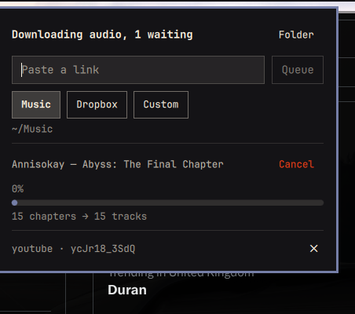

# Kikeru

*Kikeru* (聞ける) — "able to listen".

An Omarchy bar widget that turns a link into an album. Paste a chaptered video
and each chapter lands in `~/Music` as its own tagged MP3; paste a playlist and
each video in it becomes a track of one album.



Stack up links and it works through them one at a time, so a night's worth of
albums can be queued in one go.

```
~/Music/
└── Kind of Blue/
    ├── 01 - So What.mp3
    ├── 02 - Freddie Freeloader.mp3
    └── 03 - Blue in Green.mp3
```

Every track carries its own title, the album name, an artist, a track number,
and the video thumbnail as cover art — so a music player reads the folder as a
record rather than as one file repeated under different names.

## Playlists

A playlist *is* the album. Every video in it becomes one track, numbered by
playlist position, all in a single folder named from the playlist's own title
by the same rules a video title gets:

```
~/Music/
└── Fantasma/
    ├── 01 - Mic Check.mp3
    ├── 02 - The Micro Disneycal World Tour.mp3
    └── 03 - New Music Machine.mp3
```

The track title is the video's title with the noise taken out — a leading
`Artist - ` is dropped when it just repeats the album's artist, and `(Official
Audio)`-style bracketed junk goes the way it does everywhere else. The file is
renamed to match, so the folder reads the same as a chapter-split one rather
than keeping yt-dlp's raw video titles.

Chapters *inside* a playlist video are deliberately ignored: one video is one
track. Splitting them would nest an album inside an album and renumber
everything after it. Set `playlistMode` to `separate` for the old behaviour,
where each video becomes its own album folder.

## Japanese uploads

`ポルノグラフィティ『サウダージ』MUSIC VIDEO` is the house style of Japanese label
channels: the song name sits inside the corner brackets, the artist comes
before them, and the rest is shelf-talk. Both halves are read — the brackets
give the track title, and the prefix names the artist when a playlist carries
no uploader of its own. `『』`, `「」`, `〈〉` and `《》` all count.

## Uploading to MiniDisc

Web MiniDisc queues dropped files in the order the browser hands them over and
never re-sorts them — its `onDrop` is a plain `concat`. A browser hands over a
multi-file selection in **filename** order, and it does not look at the track
number in the ID3 tag. So the number has to be in the filename or the album
reaches the disc shuffled, which is why `trackFilenames` defaults to
`number-title`.

That number would then show up in the disc titles, because Web MiniDisc's own
**Title format** defaults to `Filename`. Set it to **Title** in the upload
dialog and it reads the ID3 title tag instead — correct order from the
filename, clean titles from the tag. `Artist - Title` and `Album - Title` are
there too if you want more on the disc.

## Fixing an album after the fact

`retag-album` retitles and retags a folder that is already on disk — useful for
anything downloaded before a naming rule existed:

```sh
./retag-album ~/Music/Some\ Album --artist "ポルノグラフィティ"
./retag-album ~/Music/Some\ Album --artist "ポルノグラフィティ" --apply
```

Without `--apply` it prints what it would do and changes nothing. It copies
streams rather than re-encoding, so cover art survives and it costs
milliseconds per track.

## Why this exists

`yt-dlp --split-chapters` already cuts the audio in the right places. What it
does not do is retag the pieces: each chapter file inherits the *video's*
metadata, so all of them come out titled after the video, with no album, no
track number, and the entire video description stuffed into a comment field.

Every other Omarchy yt-dlp widget stops at "download this link". This one keeps
yt-dlp's split and adds a second pass — an `ffmpeg -c copy` retag that wipes the
inherited metadata and writes the chapter's own, keeping the cover-art stream.
No re-encode, so it costs milliseconds per track.

## Requirements

Omarchy 4 (Quattro). `yt-dlp`, `ffmpeg`, `jq`, `wl-clipboard` — all present on a
stock install.

## Install

```sh
omarchy plugin add https://github.com/martin-irwin/omarchy-kikeru.git --enable
```

Then put it on the bar:

```sh
omarchy bar put kuroshi.kikeru right
omarchy restart shell
```

To remove it: `omarchy plugin remove kuroshi.kikeru`. Nothing is installed
outside the plugin folder, and nothing under `~/Music` is touched on removal.

## Use

Click the ♪ in the bar, or bind the panel to a key in
`~/.config/hypr/bindings.lua`:

```lua
-- open the panel with the clipboard link pre-filled
o.bind("SUPER SHIFT", "M", "exec, quickshell ipc -p /usr/share/omarchy/shell call kuroshi.kikeru toggle")

-- skip the panel entirely: grab whatever link is in the clipboard, right now
o.bind("SUPER SHIFT", "N", "exec, quickshell ipc -p /usr/share/omarchy/shell call kuroshi.kikeru grab")
```

Middle-clicking the bar icon opens the folder of the last download. While a
download runs, the bar shows its percentage next to the ♪.

### Queueing

**Add** puts the link in the queue and starts it if nothing else is running;
while a download is in flight the button reads **Queue** and the link waits its
turn. The header keeps count — *"Downloading audio, 2 waiting"* — and each
waiting row has an ✕ to drop it.

**Cancel** stops the download in flight and moves on to the next queued link;
it does not abandon the queue. To bind either:

```lua
o.bind("SUPER SHIFT", "C", "exec, quickshell ipc -p /usr/share/omarchy/shell call kuroshi.kikeru cancel")
o.bind("SUPER CTRL SHIFT", "C", "exec, quickshell ipc -p /usr/share/omarchy/shell call kuroshi.kikeru cancelAll")
```

The queue lives in memory: restarting the shell mid-run drops whatever was still
waiting.

### Where it lands

Three chips pick the destination — **Music**, **Dropbox**, **Custom** — and the
choice is written back to `shell.json`, so it survives a restart. Each chip keeps
its own path, so switching to Dropbox and back does not lose a custom directory
you typed.

## Settings

Options go under the plugin's entry in `~/.config/omarchy/shell.json`:

```json
{
  "id": "kuroshi.kikeru",
  "destination": "music",
  "musicDir": "~/Music",
  "dropboxDir": "~/Dropbox/Music",
  "customDir": "~/Downloads",
  "audioFormat": "mp3",
  "audioQuality": "320K",
  "playlist": "auto",
  "playlistMode": "album",
  "trackFilenames": "number-title",
  "smartNaming": true,
  "embedArt": true,
  "autoPaste": true,
  "notify": true
}
```

| Setting | Default | Notes |
| --- | --- | --- |
| `destination` | `music` | Which of the three paths below is live: `music`, `dropbox` or `custom`. The panel's chips write this back here, so a choice made in the UI sticks |
| `musicDir` | `~/Music` | The **Music** chip |
| `dropboxDir` | `~/Dropbox/Music` | The **Dropbox** chip — created on first use |
| `customDir` | `~/Downloads` | The **Custom** chip, editable inline in the panel |
| `audioFormat` | `mp3` | Anything `yt-dlp -x --audio-format` takes: `opus`, `m4a`, `flac`, `wav` |
| `audioQuality` | `320K` | A bitrate, or `0`–`9` for VBR |
| `playlist` | `auto` | `auto` follows only bare `/playlist?` links; `always` expands `&list=` too; `never` never does |
| `trackFilenames` | `number-title` | `number-title` puts the track number in front of the filename; `title` names each file for the track alone. The number goes in the ID3 tag either way — see *Uploading to MiniDisc* for why the filename needs it too |
| `playlistMode` | `album` | `album` treats the whole playlist as one album, videos as tracks. `separate` gives each video its own album folder — the pre-1.1 behaviour |
| `smartNaming` | `true` | See below |
| `embedArt` | `true` | Video thumbnail as cover art |
| `autoPaste` | `true` | Read a link from the clipboard when the panel opens |
| `notify` | `true` | Desktop notification when a run finishes |

### Smart naming

Album uploads are titled by convention, not by metadata — YouTube almost never
fills in real artist/album fields, so with `smartNaming` on the title is read
instead:

```
Annisokay - Abyss: The Final Chapter (Full Album) [LYRICS]
   → artist "Annisokay", album "Abyss: The Final Chapter"

Various Artists – Hi-Fidelity Dub Sessions - Chapter One (1999) | Full Album | Roots & Dub Vault
   → artist "Various Artists", album "Hi-Fidelity Dub Sessions - Chapter One (1999)"
```

The rules: everything after the first `|` is dropped (uploaders put the channel
name and "Full Album" there), the title splits on the first space-dash-space so
a hyphenated artist like `Jay-Z` survives, and bracketed noise — `(Full Album)`,
`[LYRICS]`, `(Official Audio)` — is stripped from the album. All three dash
characters (`-`, `–`, `—`) count as separators.

Turn it off and the album folder is named for the full video title, with the
channel as artist.

### No chapters

A link with no chapters is saved as one file named after the video, straight
into the destination folder rather than in an album folder of one.

## Layout

- `Panel.qml` — bar button and popup. Single file, with `anchorItem: button` as
  a direct binding, because that is what makes the popup open under its own
  button; assigning `anchorItem` across a `Loader` leaves it stranded mid-screen.
- `kikeru` — all of the actual work. Runs standalone:
  `./kikeru --probe-only <url>` prints what it *would* name things without
  downloading, which is the fastest way to check a link against the naming rules.
- `Model.js` — event parsing and display strings, Qt-free so `node model-test.js`
  can exercise it.
- `backend-test.sh` — runs both album paths against the stub `yt-dlp`/`ffmpeg`
  in `test/`, checking filenames, track numbers and written tags without
  touching the network. Run it after changing anything about naming.
- `kill-tree` — used by Cancel. A download is three processes deep (script →
  yt-dlp → ffmpeg) and signalling only the top one leaves the other two running;
  see the comments in that file for why the walk cannot live in the script's own
  signal trap.

The widget never calls yt-dlp itself. `kikeru` speaks a line protocol on
stdout (`stage`, `progress`, `info`, `track`, `done`, `error`, one per line) and
the panel just renders it — which keeps the download logic runnable, and
debuggable, from a terminal.

## When a percentage does not move

`--print` implies `--quiet`, and quiet suppresses the progress template along
with everything else — so every path that uses `--print` to collect filenames
needs `--progress` to force the percentage back on. Leaving it out is silent:
the download works, the bar just never moves.

## When a download fails

YouTube hands the default player client format URLs that then 403 on the media
request. `kikeru` tries the default client first and falls back to the
embedded-player client when a run produces no files, which is what gets most
403s through — you will see two "downloading" stages go by when that happens.

yt-dlp's own output for the last run is kept at `~/.cache/kikeru.log`.
